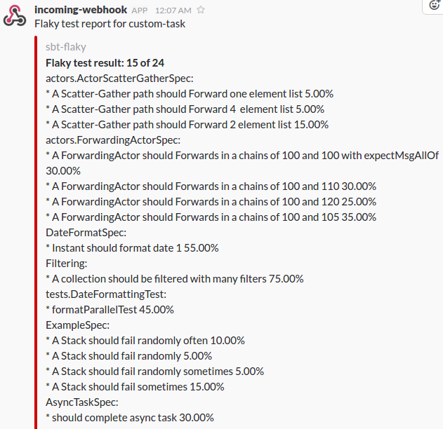

# Detecting flaky test with sbt

[](https://travis-ci.org/otrebski/sbt-flaky)

## Introduction
This project is proof of concept of flaky test detector SBT plugin. It can run test X times, for X minutes or until first failure.


## Installation

:warning: Plugin is not linked to sbt-plugin-releases yet! :warning:, you have to add http://otrebski.bintray.com/sbt-plugins to your repos. Example usage can be found in [demo project](https://github.com/otrebski/sbt-flaky-demo) 

Add plugin to project configuration `project/plugins.sbt` or global configuration `~/.sbt/0.13/plugins/plugins.sbt`
```scala
resolvers += Resolver.url(
  "flaky",
  url("http://otrebski.bintray.com/sbt-plugins"))(
  Resolver.ivyStylePatterns
 )

addSbtPlugin("pl.otrebski" % "sbt-flaky" % "0.1")
```
Don't forget to enable plugin in `build.sbt`
```scala 
lazy val library = (project in file("."))
  .enablePlugins(FlakyPlugin)
```

## How to run

Run tests 30 times:
```
sbt clean "flaky times=30"
```

Run tests 30 minutes:
```
sbt clean "flaky duration=30"
```


Run tests until first failure:
```
sbt clean "flaky firstFail"
```

## Sending reports to slack
To send report to Slack, set your Slack hook id as `flakySlackHook`. For example if your slack hook is `https://hooks.slack.com/services/AAAAAAAAA/BBBBBBBBB/CCCCCCCCCCCCCCCCCCCCCCCC `, add following line to build.sbt:

```scala
flakySlackHook := Some("https://hooks.slack.com/services/AAAAAAAAA/BBBBBBBBB/CCCCCCCCCCCCCCCCCCCCCCCC )

```


## How it works.
Command `flaky` execute `test` task multiple times. After every test iteration, test results from `./target/test-reports` is moved to `./target/flaky-test-reports/<ITERATION>`. Test task is run for X times, for X minutes or until first failing test task. All tests results are used to calculate success ratio for every test.

## Example report

Currently only simple test report is printed:
```
Healthy tests:
A ForwardingActor should Forwards in a huge chain
A ForwardingActor should Forward a message it receives
A Stack should pop values in last-in-first-out order
A Stack should throw NoSuchElementException if an empty stack is popped

Flaky tests:
A Stack should fail sometimes 20%
A Stack should fail randomly often 7%
A ForwardingActor should Forwards in a 2 huge chains 7%
A Stack should fail randomly 6%
A Stack should fail randomly sometimes 1%

Details:
ExampleSpec: A Stack should fail sometimes failed in runs: 100, 101, 104, 105, 106, 108, 116, 117, 122, 123, 125, 129, 13, 131, 134, 148, 168, 171, 172, 174, 18, 181, 183, 185, 191, 192, 198, 199, 217, 218, 219, 22, 222, 223, 227, 229, 235, 236, 239, 241, 242, 246, 252, 253, 260, 275, 279, 30, 41, 42, 59, 6, 78, 79, 81, 89, 92
ExampleSpec: A Stack should fail randomly often failed in runs: 10, 136, 143, 170, 172, 20, 21, 239, 243, 253, 259, 26, 268, 28, 284, 4, 57, 77, 82, 94, 96
TestKitUsageSpec: A ForwardingActor should Forwards in a 2 huge chains failed in runs: 10, 118, 13, 143, 199, 21, 22, 228, 229, 23, 256, 264, 266, 271, 284, 49, 66, 67, 79, 85, 89
ExampleSpec: A Stack should fail randomly failed in runs: 119, 120, 154, 160, 169, 186, 196, 20, 229, 230, 235, 240, 262, 263, 5, 58, 65, 72, 86
ExampleSpec: A Stack should fail randomly sometimes failed in runs: 113, 141, 160, 225, 283
```
## Example slack notification

Successful report example:


Failure report example:




## Backing up log files from every test run
To backup log files from every test run, specify list of files with property `flakyAdditionalFiles := List(new File("target/test.log")))` Example can be found here:

https://github.com/otrebski/sbt-flaky/blob/master/src/sbt-test/sbt-flaky/moveAdditionalFiles/build.sbt

## Reduce amount of console output
If project contains a lot of tests it can produce huge output if test is run multiple times. To reduce amount of output use `flakyLogLevelInTask` to change logger level when running flaky command.
```scala
flakyLogLevelInTask := sbt.Level.Info
```
Test classes and application can produce output to console. Consider changing log levels for tests.


## Known issues

If running a lot of tests for a many times you can get Out of memory error: `java.lang.OutOfMemoryError: Metaspace`. On report you will find flaky test `(It is not a test)`. Best options and good practice is to run Tests in separate JVM (fork). Details can be found in [sbt documentation](http://www.scala-sbt.org/0.13/docs/Forking.html)

The other cause of `(It is not a test)` on report is issue https://github.com/scalatest/scalatest/issues/780

## Example project
Checkout this [example project](https://github.com/otrebski/sbt-flaky-demo) 

# TODO
- [x] Run tests X times
- [x] Run tests for X minutes
- [x] Run test until first failure
- [x] Copy log file to run test iteration dir
- [x] Execute webhook after tests (slack)
- [x] Create SBT plugin
- [x] Select custom task to run insead of `Test`
- [ ] Disabling sending report to slack based on ENV variable (for running locally)
- [ ] Generating report (HTML, XML or JSON)
- [ ] Select single test (or test class) to run (like testOnly task)
- [ ] Keeping track of history
- [ ] Based on history show trends
- [x] Use results only from last runs. Ignore junk dirs from other `flaky` run
- [x] [Suppress output from test](https://github.com/otrebski/sbt-flaky/issues/2) 
- [x] Display nice progress with ETA
- [ ] If project is using git, list changes since last run on report.
- [x] Add colors to console output


# Merge request are welcome !
 
